# TP2 : Capteurs, liste et fragments

Hugo SILIVERI

Lien du Git : https://github.com/HugoSiliveri/tp2-mobile

### Environnement

- Minimum SDK : API 24 (Nougat)
- Appareil virtuel utilisé : Pixel 8 API 35 (Android 15)
- Appareil physique utilisé : Samsung S20 API 33 (Android 13)

### Description des fichiers

- `MainActivity.kt` : Activité principale de l'application (page d'accueil pour accéder aux autres activités)
- `SensorList.kt` : Affichage de la liste des capteurs disponibles (exercice 1)
- `SensorAvailability.kt` : Affichage de la liste des capteurs indisponibles (exercice 2)
- `Accelerometer.kt` : Affichage de différentes couleurs en fonction de l'accélération (exercice 3)
- `Direction.kt` : Affichage de la direction du mouvement (exercice 4)
- `Flashlight.kt` : Allumage/Eteignage de la lampe-torche en secouant le téléphone (exercice 5)
- `Proximity.kt` : Affichage d'images en fonction de la proximité du capteur (exercice 6)
- `Geolocation.kt` : Afficahge des coordonnées géographiques du téléphone (exercice 7)
- `CountriesList.kt` : Affichage de la liste des pays (exercice 8)
- `CountriesListInfo.kt` : Affichage des informations détaillées d'un pays (exercice 8)
- `CountriesAdapter.kt` : Adapteur de la liste des pays (exercice 8 et 9)
- `CountryData.kt` : Données des pays (exercice 8 et 9)
- `CountriesFragmentActivity.kt` : Activité contenant les fragments (exercice 9)
- `CountriesFragment.kt` : Fragment de la liste des pays (exercice 9)
- `CountriesFragmentInfo.kt` : Fragment des informations détaillées d'un pays (exercice 9)

### Exercice 1

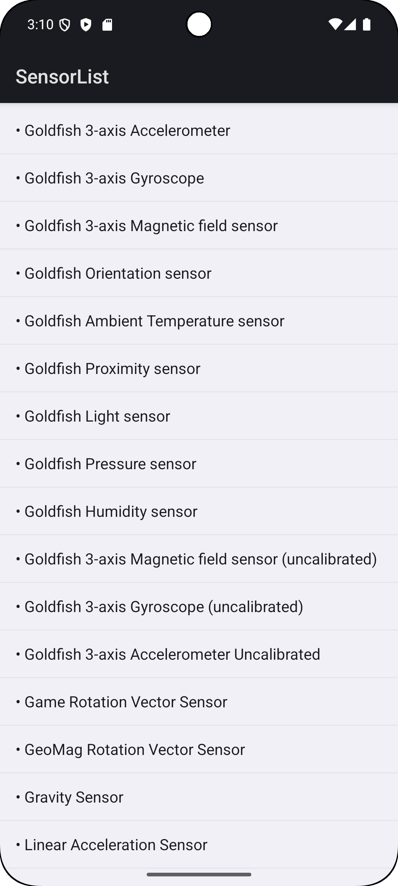

### Exercice 2 (réalisé sur un appareil physique)

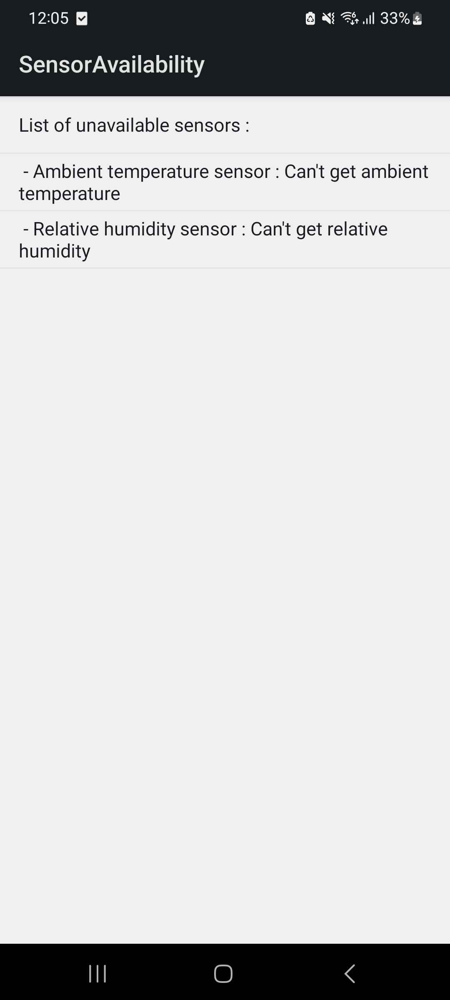

### Exercice 3

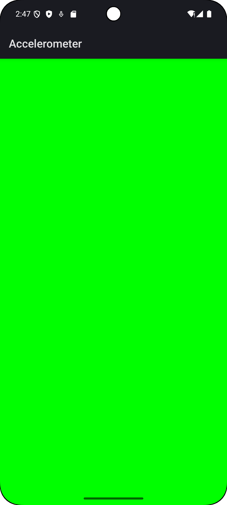

### Exercice 4

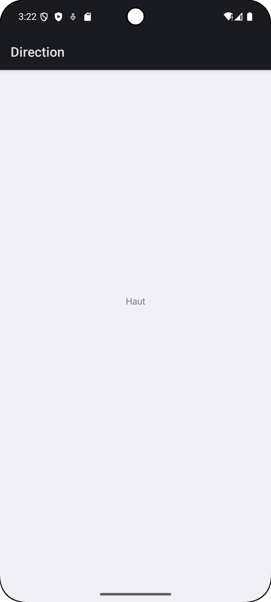

### Exercice 5

J'ai mis un toast pour afficher si la lampe est allumée ou éteinte sur l'appareil viruelle.
Sinon la lampe s'allume/s'éteint bien sur l'appareil physique.

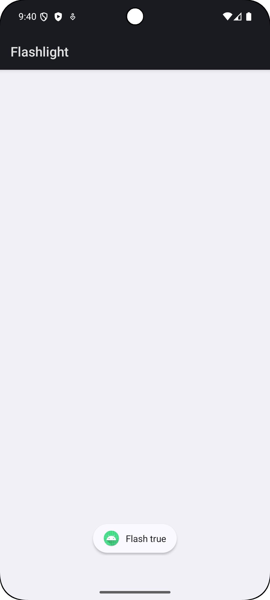

### Exercice 6

L'image du chat qui tire la langue c'est pour un objet proche.

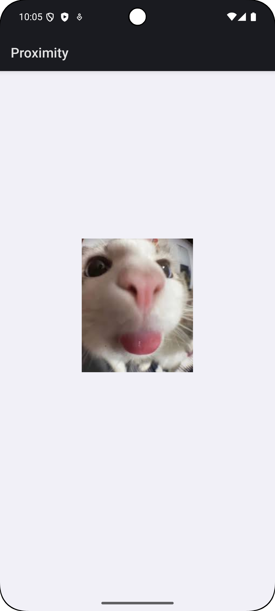

L'image du chat qui regarde c'est pour un objet loin.

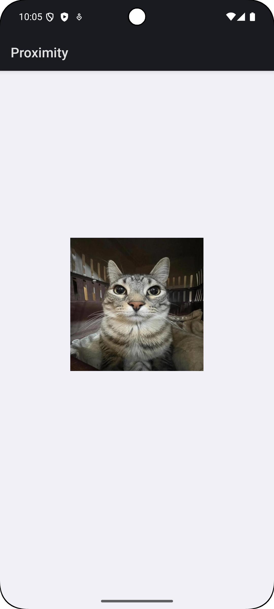

### Exercice 7

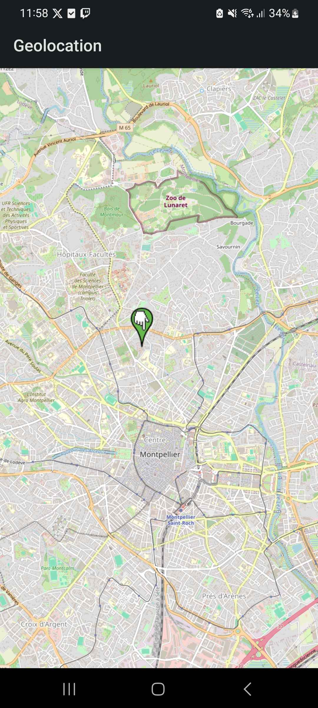

### Exercice 8

Les drapeaux étaient au format SVG, pour les utiliser dans les ImageView j'ai du les transformer en 
VectorAsset. Cependant, pour le drapeau des Etats-Unis, cela donne un résultat étrange avec les étoiles

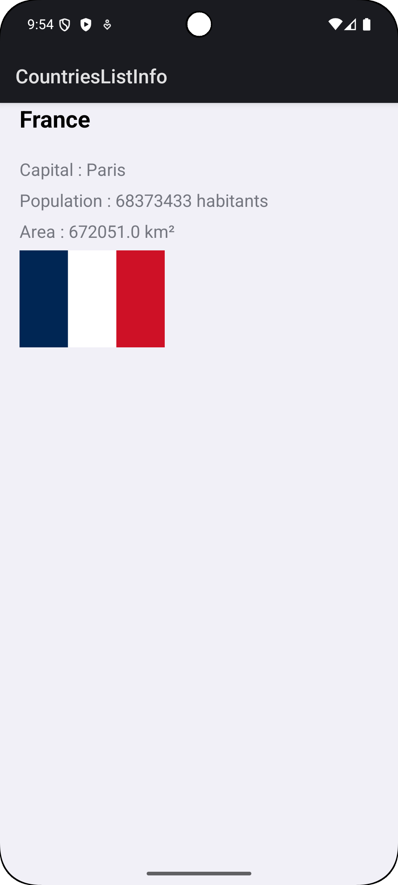

### Exercice 9

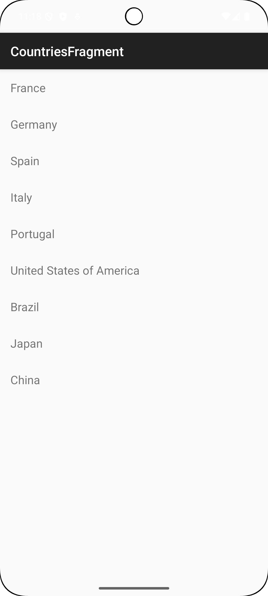
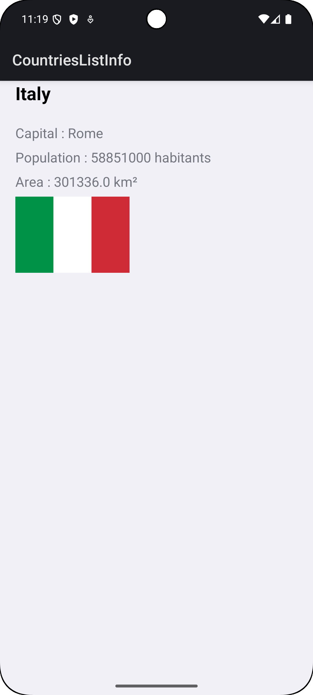